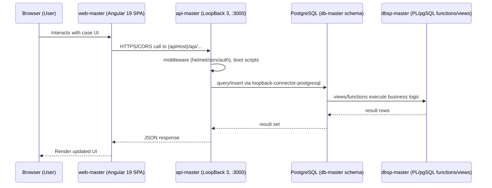

# CJAMS Portal — Architecture

Last reviewed: 2026-09-10

> **Correction to assumed baseline:** despite the "CJAMS" naming and the common assumption that this
> stack runs on Oracle, every module actually runs on **PostgreSQL**. `api-master`'s only DB connectors
> are `loopback-connector-postgresql`/`mysql` (no `oracledb`), and `db-master`/`dbsp-master` are pure
> PL/pgSQL (`LANGUAGE plpgsql`, `jsonb`, `gen_random_uuid()`, Postgres `GRANT ... ON ALL TABLES IN SCHEMA`
> syntax) with `views.sql` being a literal `pg_dump` export. There is no Oracle anywhere in this codebase.
> Treat any prior documentation, tooling, or onboarding material that assumes Oracle as stale.

## 1. System overview

CJAMS ("Maryland Benefits CJAMS CW App") is a welfare/benefits case-management portal. A browser-based
Angular SPA (`web-master`) calls a single Node.js/LoopBack 3 REST API (`api-master`), which reads and
writes a PostgreSQL database whose schema and business logic are version-controlled as SQL/PLpgSQL in two
sibling repos: `db-master` (DDL/DML/grants/migrations) and `dbsp-master` (PL/pgSQL functions and views).
A meaningful share of business logic lives in the database layer (functions + views), not just in the API.

## 2. Module map

| Module | Responsibility | Talks to |
|---|---|---|
| `web-master` | Angular 19 SPA: case management UI, provider portal, contact log, external assessment, etc. | `api-master` over HTTPS/CORS, hardcoded `apiHost` per environment file (no dev proxy) |
| `api-master` | LoopBack 3 REST API (`/api`), auth, document generation (PDF/DOCX/XLSX), batch/cron jobs, file storage, SOAP/external integrations (Jira, ECM/EDMS, MDM, Beacon) | PostgreSQL (via `loopback-connector-postgresql`), AWS Secrets Manager/STS (non-local envs), S3/local filesystem storage |
| `db-master` | Schema-as-code: tables, grants/roles, RBAC seed data, incremental migrations, one-off hotfixes/data fixes, legacy data migration, external interface tables | PostgreSQL, applied via Jenkins release process |
| `dbsp-master` | PL/pgSQL business logic living in the DB: ~3,150 functions (one per file) + `views.sql` (pg_dump export, 169 views + assorted tables/trigger functions) | Reads/writes tables defined in `db-master`; called from `api-master` and directly by views |

Data flow: **Browser → Angular SPA → LoopBack REST API → PostgreSQL (tables from db-master, business logic
in dbsp-master functions/views) → response back up the chain.** Some business rules are enforced only in
PL/pgSQL functions/views, so understanding a feature often requires reading both `api-master` and
`dbsp-master`, not just the API layer.

## 3. Tech stack

### web-master (frontend)
- **Angular 19.2.14** (Angular CLI/build-angular 19.2.14), TypeScript ^5.8.3, RxJS ^7.8.2 (+ `rxjs-compat` ^6.6.7 for legacy code), zone.js ^0.15.1
- UI: Angular Material 19.2.18 + CDK, Bootstrap 5.3.6 + ng-bootstrap 18 + ngx-bootstrap 19, jQuery 3.7.1, ng-select, ngx-toastr, Highcharts, GoJS, Quill/ngx-quill, Dynamsoft DWT (scanning), exceljs, jsPDF
- No NgRx/state library — state handled via Angular services
- No Node version pinned (no `.nvmrc`/`Dockerfile`); Angular 19 + TS 5.8 requires **Node 18.19+ or 20.x**
- Workspace project is internally still named `test-ng4` in `angular.json`
- 21 environment files (`dev`, `dev1-4`, `stg1-4`, `trn1`, `uat`, `sit`, `prod`, `prd1`, …); **production build config uses `environment.prd1.ts`**, not the more obvious `environment.prod.ts`
- No `proxy.conf.json` — each environment file hardcodes an absolute `apiHost`; CORS handles cross-origin calls
- Test tooling (Karma/Jasmine, Protractor) present but no `test`/`e2e` npm scripts wired up

### api-master (backend)
- **LoopBack 3.19.0** on Node.js (`loopback-boot` 2.27.1, `loopback-datasource-juggler` 3.23.0). `engines.node: >=4` in package.json is stale — `package-lock.json` is lockfile v2 (npm 7+/Node 15+), and dependencies like `puppeteer ^24.10.0` and AWS SDK v3 require a **current Node LTS (18+ recommended)**. CI's `bitbucket-pipelines.yml` pins `node:6.9.2`, which is inconsistent with the actual dependency tree — treat that as stale, not authoritative.
- DB connector: `loopback-connector-postgresql` ^5.4.0 (no Oracle connector present)
- Security/middleware: helmet, strong-error-handler, xss, joi ^14.3.1
- Documents/reporting: twig, html-docx-js, exceljs, puppeteer (PDF rendering — downloads Chromium on `npm install`)
- Scheduling: node-schedule
- Cloud/integration: `@aws-sdk/client-secrets-manager`, `aws-sdk` v2, New Relic, soap, googleapis, nodemailer, log4js
- No build/test npm scripts wired (mocha/chai/supertest are unused devDependencies); only `start` and `lint`
- Deployment: AWS CodeDeploy (`appspec.yml`, `codedeploy.py`) to `/usr/local/welfare_master_lb`, package built/pushed via Bitbucket Pipelines

#### External integrations (api-master → third parties)

All external traffic in the system flows through `api-master` — `web-master` talks only to `api-master`'s own
REST API (no direct third-party calls from the browser, aside from a bundled Dynamsoft scanning SDK asset under
`web-master/src/assets/images/dwt/`). Config for all of the below lives in `server/config.json`, resolved via
`${...}` placeholders or `smLocalValues` at runtime; calls are made with `axios` (e.g.
`common/models/beacon.js:7,108`) and the `soap` package (METS).

| Service | Purpose | Config location |
|---|---|---|
| AWS Secrets Manager + STS | Fetches API keys/DB credentials at boot (non-local envs only) | `server/getapikeys.js`, `server/awsdbrotation.js` |
| AWS S3 / CloudFront | File storage & download URLs | `s3Config` — `config.json:34-38` |
| AWS SES (SMTP) | Outbound transactional email | `awsMail` — `config.json:91` |
| Beacon (MDTEIS) | SSN verification lookups (single + bulk) | `beconConfig` — `config.json:52-60`; `common/models/beacon.js` |
| MDM (Master Data Management gateway) | Person/case data sync | `integrationConfig.urlMDM` — `config.json:41-45` |
| Pipl | People-search lookup | `integrationConfig.peoplesearch` — `config.json:44` |
| R360 person search | Enhanced/detailed person & program search | `personSearchConfig` — `config.json:62-69` |
| ECM / EDMS | Upload/update/download/delete case documents | `uploadFileToECMSPath`, `uploadFileToEDMSPath`, etc. — `config.json:95-102` |
| Google APIs (Drive/Sheets) | Defect-tracker service account writes to a Drive folder/Sheet | `googleapis` block — `config.json:119-133` |
| METS | SOAP/WSDL web service (legacy interface) | `METSWSDL`/`METSUSER`/`METSPASS`, `metsServicePath` — `config.json:92,134-136` |
| Jira Service Desk | Creates/queries support tickets from within the app | `jiraobj` — `config.json:139-148` |
| Corticon | Business rules engine API | `CORTICONAPI` — `config.json:137` |
| Binti (ESB) | External service bus integration | `binti.esb_base_url` — `config.json:149-151` |
| New Relic | APM telemetry | dependency in `package.json` |

None of these are required for core case-management flows in local dev: with `"environment": "local"` in
`config.json`, Secrets Manager/STS is bypassed at boot, and the rest are called lazily per-feature — a request
that touches Beacon, ECM/EDMS, Jira, MDM, Corticon, or Google Drive will simply fail/no-op if that integration
isn't configured, without blocking the rest of the app.

### db-master / dbsp-master (database)
- **PostgreSQL** (exact server version not pinned in-repo; `jsonb` + `gen_random_uuid()` usage implies a reasonably modern version — confirm against an existing environment's DBA)
- `db-master`: `DDL/`, `DML/`, `MASTER/` (incremental, non-strict numbering), `Grants/` (per-env role/schema grants: `cjams_app_user`, `cjams_dev_admin`, `cjams_batch_user`, etc.), `RBAC*/` (seed permission data), `HOTFIX/`, `PROD_DATA_FIX/`, `PROD_CDR/`, `TIGERTEAMSCRIPTS/` (one-off prod fixes), `DATAMIGRATION/CW/` (legacy migration), `Interfaces/` (external interface tables), `CJAMS_DB_FUNCTIONS/` (procedures organized A–R). No master run-all script and no CREATE USER/ROLE/TABLESPACE script — roles are assumed pre-existing.
- `dbsp-master`: `functions/` — ~3,150 flat files, one PL/pgSQL function/procedure each, no extension, named by business purpose (e.g. `addprovider`, `getappealdashboard-2`, `sp_efc_rfc_ticklers`). `views.sql` (~14MB) is a literal `pg_dump` schema export containing 169 `CREATE VIEW` statements interleaved with ~2,211 other object definitions (legacy/backup tables, trigger functions) — treat it as a directory of logical units, not a file to read end to end.
- Load order (inferred, not documented anywhere in-repo): db-master DDL/MASTER → DML → RBAC → Interfaces → Grants (needs `cjams.createnewuser`, so at least that function must exist first) → dbsp-master functions → dbsp-master views.sql last (views depend on both tables and functions).

## 4. Deployment / CI topology

- **api-master**: Bitbucket Pipelines build (stale `node:6.9.2` image) → artifact → AWS CodeDeploy (`appspec.yml` + `codedeploy.py`) → EC2 target running under `/usr/local/welfare_master_lb`.
- **web-master**: no CI pipeline file found in this checkout; presumably built (`ng build --configuration=<env>`) and deployed as static assets separately.
- **db-master / dbsp-master**: Jenkins-driven release process (`cjams_db_scripts_releaselist*.txt` are Jenkins build stamps, not manifests) applying scripts incrementally per environment — no from-scratch build automation exists.

## 5. Known architectural risks / smells

- **No Oracle vs. Postgres confusion should recur**: the CJAMS/db-master naming and folder structure (RBAC, HOTFIX, etc.) reads like a typical Oracle enterprise schema pattern, but the actual engine is Postgres end-to-end. Any tooling, runbook, or new engineer onboarding that assumes Oracle will misconfigure the environment.
- **Stale/contradictory version signals**: `api-master`'s `engines.node: >=4` and CI's `node:6.9.2` image are incompatible with actual dependencies (puppeteer 24, AWS SDK v3, lockfile v2). No `.nvmrc` anywhere in any of the four repos — Node version is tribal knowledge only.
- **No fresh-build automation for the database**: `db-master`/`dbsp-master` have no master script, no CREATE ROLE/TABLESPACE script, and non-strict/duplicate numbering in `DDL`/`DML`/`MASTER`. Standing up a clean local DB requires manual reconciliation of load order.
- **Business logic split across three layers**: LoopBack model/controller code, ~3,150 individual PL/pgSQL functions, and a monolithic `views.sql` pg_dump. This makes it hard to trace where a given business rule actually lives, and hard to test PL/pgSQL logic outside a live database.
- **Production credentials path bypassed for local dev via a config flag**: `api-master/server/config.json`'s `"environment"` field switches between AWS Secrets Manager/STS (prod-like) and a plaintext `dbhosturls`/`smLocalValues` fallback (`"local"`). This is convenient for local runs but means secrets-handling code has a silent bypass mode that must be remembered to re-enable for anything prod-like.
- **`views.sql` mixes concerns**: as a raw `pg_dump` export it contains legacy/backup tables and trigger functions alongside the 169 actual views, with no separation — makes it error-prone to hand-edit or diff.
- **Frontend environment/build config mismatch**: `angular.json`'s `production` configuration points to `environment.prd1.ts`, while a separate, more obviously-named `environment.prod.ts` file exists unused — a likely source of "I edited the wrong file" bugs.

## 6. Local development setup

Run in this order: **database → api-master → web-master**.

### 6.1 Database (db-master + dbsp-master)

1. Install PostgreSQL locally (version not pinned in-repo — a reasonably recent version, e.g. 13+, is safe given `jsonb`/`gen_random_uuid()` usage; confirm with whoever manages an existing environment if exact parity matters).
2. Create schemas: `cjams`, `prov`, `defecttracking`.
3. Create the app roles referenced by `db-master/Grants/*` (no script creates them from scratch): `cjams_app_user`, `cjams_dev_admin`, `cjams_dev_readwrite`, `cjams_dev_readonly`, `cjams_batch_user`, `prov_app_user`, `aps_app_user`.
4. Apply `db-master/DDL/*` and `db-master/MASTER/*` (dedupe/reorder by inspection — numbering isn't strictly sequential).
5. Apply `db-master/DML/*` (seed/reference data), then `db-master/RBAC/` and `db-master/RBAC_06JUNE20/`.
6. Apply `db-master/Interfaces/DDL` then `Interfaces/DML` if you need external interface tables.
7. Load `dbsp-master/functions/*` (all files — no extension, plain `.sql` content) into the target schema. Do this before the grants step below if any grant script calls a function like `cjams.createnewuser`.
8. Apply `db-master/Grants/cjams_*_proc_grant_owner.sql` (pick a Dev-environment variant) and a `Dev-Users.sql`-style script to create test users.
9. Load `dbsp-master/views.sql` last (it depends on both tables and functions). Given its size (~14MB), run it via `psql -f views.sql`, not through a GUI tool that loads it into memory as one string.
10. Skip `HOTFIX/`, `PROD_DATA_FIX/`, `PROD_CDR/`, `TIGERTEAMSCRIPTS/`, `DATAMIGRATION/CW/` unless you specifically need to reproduce a production data state.

### 6.2 api-master

1. Install a current Node.js LTS (18.x or 20.x — ignore the stale `engines: >=4` and CI's `node:6.9.2`).
2. `npm install` in `api-master` (this will download a Chromium binary for puppeteer).
3. Edit `server/config.json`:
   - Set `"environment": "local"` — this bypasses AWS Secrets Manager/STS calls in `server/getapikeys.js` and `server/awsdbrotation.js`, which will otherwise fail/hang without AWS credentials.
   - Fill `dbhosturls.DB_URL` (and `SECONDARY_DB_URL` if used) with your local Postgres connection string, e.g. `postgres://<user>:<pass>@localhost:5432/<dbname>` — these feed `${DB_URL}`/`${SECONDARY_DB_URL}` placeholders in `server/datasources.json`.
   - Set/verify `LOCALFILE_ACCESS_URL` for the local file-storage datasource, and ensure `./outputs/` is writable.
   - Fill any values you need in `smLocalValues` if you exercise features that would otherwise read from Secrets Manager (e.g. Beacon/Jira/ECM integration keys) — otherwise those integrations will simply fail when called, which is fine for core case-management flows.
4. Run `npm run start` (or `node server/server.js`). The server listens on `0.0.0.0:3000`; API is mounted at `/api`; LoopBack Explorer is available at `/explorer/`.
5. No Oracle Instant Client or any Oracle tooling is required.

### 6.3 web-master

1. Same Node.js version as api-master (18.x/20.x) — Angular 19/TypeScript 5.8 requires it.
2. `npm install` in `web-master`.
3. Confirm `src/environments/environment.ts` (the default dev config) has `apiHost: 'http://localhost:3000/api'` — matches api-master's default port, so no proxy config is needed.
4. Run `npm start` (serves on Angular CLI default port **4200**) or `npm run serve` (port **4201**).
5. For a specific target environment build/serve, pass `--configuration=<dev1|dev2|...>` — but note `production` maps to `environment.prd1.ts`, not `environment.prod.ts`.

### 6.4 Verifying the stack end-to-end

- Confirm api-master boots cleanly and `http://localhost:3000/explorer/` loads the LoopBack API Explorer.
- Confirm web-master's dev server loads at `http://localhost:4200` and successfully calls the local API (check the browser network tab for `http://localhost:3000/api/...` requests returning 200s, not CORS errors).
- If API calls fail with DB errors, verify the load order in §6.1 was followed completely, especially that `dbsp-master` functions/views were loaded after `db-master` tables.
